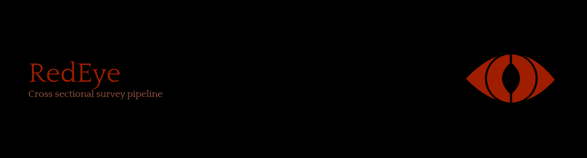

# Overview
RedEye is a data scraping pipeline intended for use in cross sectional surveys by users with limited programming expertise. It is designed to rapidly extract author-linked metadata (ie; emails, institutions, etc...) from provided PMIDs. 
#### Please cite this repository if you use the software within

## Pre-requisites

Ensure that you have [R](https://www.r-project.org/), [R studio](https://posit.co/download/rstudio-desktop/) and [Python](https://www.python.org/) installed on your machine

## Using the pipeline

1. Download [RedEye.zip](https://github.com/Inebriateduck/RedEye_Pipeline/blob/main/Stable%20Release/RedEye.zip)
2. Unzip the file
3. Open R studio and install the RedEye package by doing the following: Tools > Install Packages > Package Archive File > RedEye.tar.gz.
4. Once installed, RedEye can be loaded in R and uses identical functions as easyPubMed.
5. Create a new R script
6. Copy the [RedEye Extractor](https://github.com/Inebriateduck/RedEye_Pipeline/blob/main/Unstable%20Release/Single%20shot%20pipeline/Unstable%20extractor.R) into your new script section
7. Replace 'Input pathway' with the pathway to the *folder* containing your PMID bearing CSV files
8. Replace 'Output pathway' with your desired output directory. If the specified file does not exist, RedEye will make a new file with that name at the target location
9. Replace 'Python input' with the path to the Hex Breaker file in the .zip file (including the file itself, it should have .py at the end)
10. Run the script (*Ctrl + Shift + Enter is a useful shortcut*).  RedEye is designed to aggressively leverage the parallel processing capabilities of a system by using n-1 threads at default settings, where n = the number of threads in a a system- as such, systems with a higher CPU thread count will complete jobs faster. Note that even with strong system specs, very large files can have extended run times. 

# Technical notes

## Pipeline Components
### RedEye.R
**RedEye.R** is an R package based on easyPubMed by [Damiano Fantini](https://cran.r-project.org/web/packages/easyPubMed/index.html). It contains greedier regular expressions optimized towards the extraction of email addresses from provided PMIDs.
 
### installation
RedEye.R is not available through CRAN - installation must be performed manually. The tar.gz file can be found in the [RedEye.zip](https://github.com/Inebriateduck/RedEye_Pipeline/blob/main/Stable%20Release/RedEye.zip) file or as an [individual download](https://github.com/Inebriateduck/RedEye_Pipeline/tree/main/Stable%20Release/Single%20shot%20pipeline/RedEye)

After downloading and unzipping (if the .zip file was used), open R and do the following: Tools > Install Packages > Package Archive File > RedEye.tar.gz. 

### RedEye Extractor & Hex Breaker
[RedEye Extractor](https://github.com/Inebriateduck/RedEye_Pipeline/tree/main/Stable%20Release/Single%20shot%20pipeline/RedEye) is a specialized script for extraction of information for cross sectional surveys from the PubMed database. This script is designed to be easily scalable with the capabilities of the users hardware - the more CPU cores you have, the faster you'll be able to mine your target information from a list of PMIDs. Note that this script only reads CSV files, it does not read XLSX format.

Hex Breaker is the second step in the pipeline, and is automatically called by the R script on completion of the R section of the job. It is a python script that removes duplicate values (ie: email addresses) and cleans up invalid outputs. When removing duplicate emails, Hex Breaker will maintain the most recent instance of the address (for example, one found in 2024 will be removed in favour of one from 2025). It is included in the [RedEye.zip] (https://github.com/Inebriateduck/RedEye_Pipeline/blob/main/Stable%20Release/RedEye.zip) file.

#### This is still actively under development - It is developed as a volunteer project when I have time (updates may be sporadic)
**All code Licensed under GPL-2**

C. Daniel Fry, 2025
